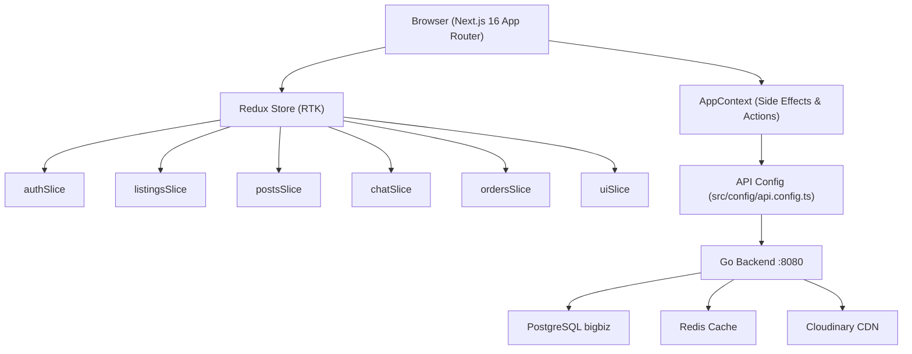

# 🏗️ BizSocial Enterprise Architecture & Developer Documentation

> **Complete System Specification, Component Directory, State Machine, Redux Store, Config Architecture, 150-User Seeding Engine & Modular Development Guide.**

---

## 🌟 1. System Overview & Portfolio Architecture

BizSocial is a **Social B2B Commerce & Escrow Liquidation Platform** that integrates:

1. **Multi-Role Social Network**: Free & VIP Buyers, Free & PRO Verified Sellers, Corporate Procurement Desk, and Super Admin.
2. **Dynamic Product Customization Engine**: Multi-variant SKU pricing, add-on feature checklists, and multi-choice option sections with seller defaults (`⭐ isDefault`).
3. **Escrow Vault & Payout Protection**: Milestone-based funds holding, buyer confirmation release, automated dispute arbitration desk.
4. **Direct B2B Buyout Desk ("Sell to Us")**: Direct liquidation to corporate buyers with instant valuation & counter-offer mechanisms.
5. **Private Admin Mission Control**: 1600px full-width terminal for user governance, listing takedowns, monetary policies, and SHA-256 audit logs.
6. **Automated 150-User Go Backend Seeder**: On 1st database table creation, 150 realistic users with unique verified avatars are automatically pushed into PostgreSQL `bigbiz.users`.

---

## 🗺️ 2. Architecture Diagram



---

## ⚙️ 3. Centralized API Configuration

**File:** [`src/config/api.config.ts`](file:///e:/project/new_project/src/config/api.config.ts)

> [!IMPORTANT]
> ALL backend URLs, API base addresses, gateway URLs, and endpoint paths are defined exclusively in `api.config.ts`. **Do NOT hardcode any URLs in components or hooks.** Always import from this config.

### 3.1 Environment Variables (`.env.local`)

| Variable | Default | Description |
|---|---|---|
| `NEXT_PUBLIC_API_BASE_URL` | `http://localhost:8080/api` | Go backend API base URL |
| `NEXT_PUBLIC_SERVER_URL` | `http://localhost:8080` | Go backend server URL |
| `NEXT_PUBLIC_CLIENT_URL` | `http://localhost:3000` | Next.js frontend URL |
| `NEXT_PUBLIC_EWALLET_GATEWAY_URL` | `https://lyren-client.vercel.app` | E-Wallet payment portal URL |
| `NEXT_PUBLIC_CHAIN_HOOK_GATEWAY_URL` | `https://chain-hook-backend-evj9.vercel.app` | Chain Hook API gateway URL |
| `NEXT_PUBLIC_CLOUDINARY_CLOUD_NAME` | `bigbiz` | Cloudinary cloud name |
| `NEXT_PUBLIC_CLOUDINARY_PRESET` | `bizsocial_posts` | Cloudinary upload preset |

### 3.2 API Endpoints Map

```typescript
import { API_CONFIG } from '../config/api.config';

// Resolve full URL
const url = API_CONFIG.resolveUrl(API_CONFIG.ENDPOINTS.USERS.DETAIL('42'));
// → http://localhost:8080/api/users/42

// Direct fetch
const res = await fetch(API_CONFIG.resolveUrl(API_CONFIG.ENDPOINTS.POSTS.REACT(postId)), { method: 'POST' });
```

| Domain | Endpoint Key | Path Pattern |
|---|---|---|
| Auth | `AUTH.ME` | `GET /users/me` |
| Users | `USERS.LIST` | `GET /users` |
| Users | `USERS.DETAIL(id)` | `GET /users/:id` |
| Posts | `POSTS.LIST` | `GET /posts` |
| Posts | `POSTS.REACT(id)` | `POST /posts/:id/react` |
| Inbox | `INBOX.LIST(userId)` | `GET /inbox/:user_id` |
| Inbox | `INBOX.CREATE` | `POST /inbox` |
| Messages | `INBOX.MESSAGES(id)` | `GET /messages/:inbox_id` |
| Messages | `INBOX.SEND_MESSAGE` | `POST /messages` |
| Network | `NETWORK.REQUEST` | `POST /network/request` |
| Network | `NETWORK.ACCEPT(id)` | `POST /network/accept/:id` |
| Payment | `PAYMENT.GENERATE_TOKEN` | `POST /payment/generate-token` |
| Payment | `PAYMENT.SAVE_SELLER_SETTINGS` | `POST /payment/settings` |
| Orders | `ORDERS.LIST` | `GET /orders` |
| Orders | `ORDERS.RELEASE_ESCROW(id)` | `POST /orders/:id/release-escrow` |

---

## 🗂️ 4. Redux Store Architecture

**Store Location:** [`src/store/`](file:///e:/project/new_project/src/store/)

```
src/store/
├── index.ts              # configureStore — registers all slices
├── hooks.ts              # useAppDispatch / useAppSelector typed hooks
├── StoreProvider.tsx     # <Provider store={store}> — mounted in app/layout.tsx
└── slices/
    ├── authSlice.ts      # currentUser, isLoggedIn, users, onboarding state
    ├── listingsSlice.ts  # listings, selectedListing, category, searchQuery
    ├── postsSlice.ts     # posts, stories, selectedStory
    ├── chatSlice.ts      # conversations, messages, notifications, activeChatSellerId
    ├── ordersSlice.ts    # orders, offers (Sell-to-Us), reviews, disputes
    └── uiSlice.ts        # activeTab, modal visibility flags, drawer state
```

### 4.1 Usage in Components

```tsx
import { useAppDispatch, useAppSelector } from '../store/hooks';
import { setActiveTab } from '../store/slices/uiSlice';
import { addMessage } from '../store/slices/chatSlice';

export const MyComponent = () => {
  const dispatch = useAppDispatch();
  const activeTab = useAppSelector((state) => state.ui.activeTab);
  const currentUser = useAppSelector((state) => state.auth.currentUser);

  const navigate = (tab: string) => dispatch(setActiveTab(tab));
};
```

### 4.2 Slice Summary

| Slice | State Fields | Key Actions |
|---|---|---|
| `auth` | `currentUser`, `isLoggedIn`, `users`, `showOnboarding` | `setCurrentUser`, `setUsers`, `logout`, `toggleUserVerification`, `updateUserRole` |
| `listings` | `listings`, `selectedListing`, `selectedCategory`, `searchQuery` | `addListing`, `updateListing`, `removeListing`, `setSelectedCategory` |
| `posts` | `posts`, `stories`, `selectedStory` | `addPost`, `removePost`, `toggleLikePost`, `addCommentToPost`, `addStory` |
| `chat` | `conversations`, `messages`, `notifications`, `activeChatSellerId` | `addMessage`, `addOrUpdateConversation`, `addNotification`, `markAllNotificationsRead` |
| `orders` | `orders`, `offers`, `reviews`, `disputes` | `addOrder`, `updateOrderStatus`, `updateOfferStatus`, `updateDisputeStatus` |
| `ui` | `activeTab`, `showSellToUsModal`, `showCreateListingModal`, `showLeftDrawer` | `setActiveTab`, `setShowCreateListingModal`, `setShowLeftDrawer` |

---

## 🗂️ 5. Frontend Next.js App Router — Route Map

```
app/
├── layout.tsx                      # Root layout — StoreProvider + AppProvider
├── page.tsx                        # / — Home feed
├── feed/page.tsx                   # /feed — Social posts & stories
├── marketplace/page.tsx            # /marketplace — Product catalog grid
├── settings/page.tsx               # /settings — Profile, Payment, Network, Security
├── orders/page.tsx                 # /orders — Escrow order tracker
├── dashboard/page.tsx              # /dashboard — Seller analytics & storefront
├── procurement/page.tsx            # /procurement — B2B buy desk (offers review)
├── admin/page.tsx                  # /admin — Super Admin mission control
├── help/page.tsx                   # /help — FAQ & support articles
├── sell-to-us/page.tsx             # /sell-to-us — Direct liquidation offer tracker
├── notifications/page.tsx          # /notifications — Alerts & system requests
├── messages/page.tsx               # /messages — Direct B2B messaging hub
├── messages/[id]/page.tsx          # /messages/:encryptedId — specific chat thread
├── profile/[id]/page.tsx           # /profile/:encryptedProfileId — seller storefront
└── product/[id]/page.tsx           # /product/:encryptedProductId — product detail
```

> [!IMPORTANT]
> **No catch-all `[...slug]` routes.** Every section of the app uses a dedicated, named Next.js App Router page. Dynamic parameters use encrypted slugs from [`src/utils/routeCrypto.ts`](file:///e:/project/new_project/src/utils/routeCrypto.ts).

---

## 🧩 6. Modular Component Directory

```
src/
├── config/
│   └── api.config.ts               # ← ALL API URLs & endpoint maps live here
├── store/
│   ├── index.ts                    # Redux configureStore
│   ├── hooks.ts                    # useAppDispatch / useAppSelector
│   ├── StoreProvider.tsx           # <Provider store={store}>
│   └── slices/
│       ├── authSlice.ts
│       ├── listingsSlice.ts
│       ├── postsSlice.ts
│       ├── chatSlice.ts
│       ├── ordersSlice.ts
│       └── uiSlice.ts
├── context/
│   └── AppContext.tsx              # Global side-effects, API calls, action handlers
├── components/
│   ├── AppShell.tsx                # Layout: Header + Sidebars + Drawers + Modals
│   ├── Header.tsx                  # Composed from header/ subcomponents
│   ├── header/                     # ─── MODULAR HEADER PARTS ───
│   │   ├── HeaderSearchBar.tsx
│   │   ├── HeaderCategoryChips.tsx
│   │   ├── HeaderNotificationsMenu.tsx
│   │   ├── HeaderMessagesDropdown.tsx
│   │   └── HeaderProfileMenu.tsx
│   ├── settings/                   # ─── MODULAR SETTINGS TABS ───
│   │   ├── ProfileSettingsTab.tsx
│   │   ├── PaymentMethodTab.tsx
│   │   ├── NetworkConnectionsTab.tsx
│   │   ├── SecuritySettingsTab.tsx
│   │   └── PreferencesTab.tsx
│   ├── listing-detail/             # ─── MODULAR LISTING DETAIL ───
│   │   ├── ListingImageGallery.tsx
│   │   ├── ListingSellerCard.tsx
│   │   ├── ListingPricingOptions.tsx
│   │   └── ListingReviewsSection.tsx
│   ├── seller-profile/             # ─── MODULAR SELLER PROFILE ───
│   │   ├── SellerHeaderCard.tsx
│   │   ├── SellerProductsTab.tsx
│   │   └── SellerPostsTab.tsx
│   ├── messages/                   # ─── MODULAR MESSAGING ───
│   │   ├── ConversationListPanel.tsx
│   │   ├── ChatMessageThread.tsx
│   │   └── BizBotChatPanel.tsx
│   ├── admin/                      # ─── MODULAR ADMIN CONTROLLERS ───
│   │   ├── AdminOverviewSection.tsx
│   │   ├── AdminEscrowVaultSection.tsx
│   │   ├── AdminUserGovernanceSection.tsx
│   │   ├── AdminListingCatalogSection.tsx
│   │   ├── AdminPolicyFeeSection.tsx
│   │   └── AdminAuditLogsSection.tsx
│   ├── listing-create/             # ─── MODULAR LISTING CREATOR ───
│   │   ├── ImageGalleryUploader.tsx
│   │   ├── VariantManager.tsx
│   │   └── OptionSectionBuilder.tsx
│   ├── post-create/                # ─── MODULAR POST CREATION ───
│   │   ├── SellerPostOptions.tsx
│   │   └── PostMediaUploader.tsx
│   ├── DirectMessagesView.tsx      # Messages page — composed from messages/ parts
│   ├── ListingDetailModal.tsx      # Product modal — composed from listing-detail/ parts
│   ├── SellerProfileModal.tsx      # Profile modal — composed from seller-profile/ parts
│   ├── SettingsPrivacyView.tsx     # Settings — composed from settings/ tabs
│   ├── MarketplaceView.tsx
│   ├── FeedView.tsx
│   ├── OrdersView.tsx
│   ├── SellerDashboard.tsx
│   ├── ProcurementDashboard.tsx
│   ├── AdminDashboard.tsx
│   ├── HelpSupportView.tsx
│   ├── SellToUsTracker.tsx
│   ├── LoginPage.tsx
│   └── OnboardingModal.tsx
├── hooks/
│   ├── useEWalletPayment.ts        # Payment flow hook (uses API_CONFIG)
│   └── useIncomingNetworkRequests.ts # Network accept/reject hook (uses API_CONFIG)
├── utils/
│   └── routeCrypto.ts              # encodeProfileSlug / decodeProductSlug etc.
├── data/
│   └── mockData.ts                 # 6 core test personas (no client-side seeding)
└── types.ts                        # Unified TypeScript Data Contracts
```

---

## 🔒 7. Roles & Permission Hierarchy

| Role Key | Name | Access Capabilities |
|---|---|---|
| `admin` | Super Admin | 1600px Mission Control, force dispute rulings, user sanctions, system fees. **(1st registered user ID = 1 is ALWAYS assigned Admin)** |
| `buyer_free` | Standard Buyer | Browse, comment, buy via Escrow, follow merchants, dispute orders. |
| `buyer_premium` | VIP Corporate Buyer | Priority Escrow, wholesale lot access, draft custom B2B quotes. |
| `seller_free` | Standard Seller | Basic storefront, list up to 5 products, standard 3% Escrow fee. |
| `seller_premium` | Business PRO Seller | Unlimited products, custom domain, 1.5% Escrow fee, verified badge. |
| `procurement` | Corporate Buy Desk | Review "Sell to Us" direct offers, issue counter-proposals, instant payouts. |

> [!IMPORTANT]
> **1st User Admin Invariant**: The 1st registered user (`user.ID == 1`) is **always assigned the `admin` role**. If any other role is selected during onboarding, it is ignored and their role remains `admin`.

---

## 🔐 8. URL Encryption & Dynamic Routes

**File:** [`src/utils/routeCrypto.ts`](file:///e:/project/new_project/src/utils/routeCrypto.ts)

All dynamic route parameters are encrypted to prevent database ID exposure in URLs.

| Function | Example Input | Example Output |
|---|---|---|
| `encodeProfileSlug('105')` | `'105'` | `'u_MTA1'` |
| `decodeProfileSlug('u_MTA1')` | `'u_MTA1'` | `'105'` |
| `encodeProductSlug('830')` | `'830'` | `'p_ODMw'` |
| `encodeChatSlug('21')` | `'21'` | `'c_MjE='` |

---

## 🚀 9. Developer Quick Start

### 9.1 Go Backend (`:8080`)

```bash
cd e:/project/golang

# 1. Configure .env
#    DB_NAME=bigbiz  DEBUG=true  PORT=8080

# 2. Run server — auto-migrates & seeds 150 users on 1st run
go run main.go
# Server: http://localhost:8080

# 3. Optional: force re-inject demo users one-by-one
curl http://localhost:8080/demo_file_inject
```

### 9.2 Next.js Frontend (`:3000`)

```bash
cd e:/project/new_project

npm install
npx tsc --noEmit    # 0 errors expected
npm run dev
# http://localhost:3000
```

> [!IMPORTANT]
> Start the Go backend on `:8080` **before** the frontend so `GET /api/users` resolves correctly on mount.

### 9.3 Database Reset

```bash
# From project root:
npm run db:reset

# Or via HTTP:
curl -X POST http://localhost:8080/api/posts/reset-all
```

---

## 📦 10. Backend Database Seeder

All platform demo user accounts are managed exclusively on the Go backend via `e:/project/golang/db/seeder.go`.

### Key Environment Variables (Go `.env`)

| Variable | Default | Description |
|---|---|---|
| `DB_HOST` | `localhost` | PostgreSQL host |
| `DB_PORT` | `5432` | PostgreSQL port |
| `DB_USER` | `postgres` | PostgreSQL user |
| `DB_PASSWORD` | `1111` | PostgreSQL password |
| `DB_NAME` | `bigbiz` | Database name |
| `PORT` | `8080` | Go HTTP server port |
| `DEBUG` | `false` | Enables `demo_users.json` & `/demo_file_inject` |
| `CLOUDINARY_CLOUD_NAME` | `bigbiz` | Cloudinary cloud |
| `REDIS_HOST` | `localhost` | Redis host |
| `REDIS_PORT` | `6379` | Redis port |

### Database Schema Quick Reference

| Table | Key Columns |
|---|---|
| `users` | `id`, `full_name`, `email`, `role_name`, `company_name`, `avatar_url` |
| `posts` | `id`, `user_id`, `caption` |
| `comments` | `id`, `post_id`, `user_id`, `comment` |
| `reacts` | `id`, `post_id`, `user_id`, `love_react` |
| `post_media` | `id`, `post_id`, `media_url`, `media_type`, `public_id` |
| `inbox` | `id`, `initator_id`, `participator_id` |
| `messages` | `id`, `inbox_id`, `sender_id`, `receiver_id`, `message`, `is_read` |

---

## ⚙️ 11. Dynamic Pricing Calculation Engine

$$\text{Final Unit Price} = \max\left(0, \text{Base Price} + \Delta_{\text{Variant}} + \sum \Delta_{\text{Option Items}}\right)$$

$$\text{Total Transaction Amount} = (\text{Final Unit Price} \times \text{Quantity}) + \text{Shipping Fee}$$

---

## 🧩 12. Onboarding Logic

Onboarding is triggered by `isUserProfileComplete(user)` — **not** by any boolean flag or `localStorage` key:

```ts
const isUserProfileComplete = (user: User): boolean => {
  if (!user.name || !user.email || !user.location || !user.bio) return false;
  if ((user.role === 'seller_free' || user.role === 'seller_premium') && !user.companyName) return false;
  return true;
};
```
