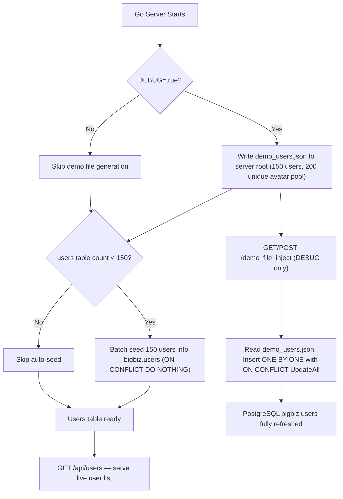

# 🏗️ BizSocial Enterprise Architecture & Developer Documentation

> **Complete System Specification, Component Directory, State Machine, 150-User Seeding Engine, Demo File Injection System & Modular Development Guide.**

---

## 🌟 1. System Overview & Portfolio Architecture

BizSocial is a **Social B2B Commerce & Escrow Liquidation Platform** that integrates:

1. **Multi-Role Social Network**: Free & VIP Buyers, Free & PRO Verified Sellers, Corporate Procurement Desk, and Super Admin.
2. **Dynamic Product Customization Engine**: Multi-variant SKU pricing, add-on feature checklists, and multi-choice option sections with seller defaults (`⭐ isDefault`).
3. **Escrow Vault & Payout Protection**: Milestone-based funds holding, buyer confirmation release, automated dispute arbitration desk.
4. **Direct B2B Buyout Desk ("Sell to Us")**: Direct liquidation to corporate buyers with instant valuation & counter-offer mechanisms.
5. **Private Admin Mission Control**: 1600px full-width terminal for user governance, listing takedowns, monetary policies, and SHA-256 audit logs.
6. **Automated 150-User Go Backend Seeder**: On 1st database table creation, 150 realistic users with unique verified avatars are automatically pushed into PostgreSQL `bigbiz.users`.

---

## 👥 2. Backend Database Seeder & Demo File Injection System

All platform demo user accounts are managed exclusively on the Go backend via [`e:/project/golang/db/seeder.go`](file:///e:/project/golang/db/seeder.go).

### 2.1 Architecture Flow



### 2.2 Key Environment Variables

| Variable | Default | Description |
|---|---|---|
| `DB_HOST` | `localhost` | PostgreSQL host |
| `DB_PORT` | `5432` | PostgreSQL port |
| `DB_USER` | `postgres` | PostgreSQL user |
| `DB_PASSWORD` | `1111` | PostgreSQL password |
| `DB_NAME` | `bigbiz` | Database name |
| `PORT` | `8000` | Go HTTP server port |
| `DEBUG` | `false` | Enables `demo_users.json` generation & `/demo_file_inject` endpoint |

Set these in [`e:/project/golang/.env`](file:///e:/project/golang/.env).

### 2.3 Auto 1st-Time Seeder

[`db/seeder.go → Seed100Users()`](file:///e:/project/golang/db/seeder.go) is called automatically by [`db/connector.go`](file:///e:/project/golang/db/connector.go) right after `AutoMigrate`:

- Checks `SELECT COUNT(*) FROM users`.
- If `count < 150`: batch-inserts all **150 demo profiles** in chunks of 50 using `ON CONFLICT DO NOTHING`.
- If `count >= 150`: skips — existing records are never overwritten.

### 2.4 `GET/POST /demo_file_inject` — Debug Mode Only

> [!IMPORTANT]
> This endpoint is **only accessible when `DEBUG=true`** in `.env`. It returns `403 Forbidden` in production.

**How it works:**
1. Reads [`demo_users.json`](file:///e:/project/golang/demo_users.json) from the Go server root (`e:/project/golang/`).
2. If the file doesn't exist yet, it is auto-generated on the fly via `CreateRootDemoJsonFile()`.
3. Inserts each user record **one by one** using `ON CONFLICT UpdateAll` — re-syncs the database with the latest JSON on every hit.

**Sample response:**
```json
{
  "status": "success",
  "message": "Successfully injected users one by one from demo_users.json into database",
  "injected_count": 150,
  "total_in_db": 150,
  "debug_mode": true
}
```

### 2.5 200 Unique Avatar Pool

[`db/seeder.go → Get200UniqueAvatars()`](file:///e:/project/golang/db/seeder.go) generates a pool of **200 provably unique avatar URLs** using deterministic `?sig=N` signatures (N = 1–200) across 56 distinct Unsplash portrait photo IDs:

```go
// Every avatar URL is unique — no two users share the same image
avatarURL := fmt.Sprintf(
    "https://images.unsplash.com/photo-%s?w=150&auto=format&fit=crop&q=80&sig=%d",
    photoID, i+1,
)
```

**Verified:** `Total users: 150 | Unique avatars: 150` ✅

### 2.7 Post, Comment, React & PostMedia Database Schema (`server/models/post.go`)

| Table | Column | Type | Constraints | Description |
|---|---|---|---|---|
| `posts` | `id` | `BIGSERIAL` | `PRIMARY KEY` | Post identifier |
| `posts` | `user_id` | `BIGINT` | `NOT NULL, INDEX` | Foreign key referencing `users(id)` |
| `posts` | `caption` | `TEXT` | `NOT NULL` | Post caption content |
| `posts` | `create_date_time` | `TIMESTAMPTZ` | `AUTO CREATE` | Creation timestamp |
| `posts` | `update_date_time` | `TIMESTAMPTZ` | `AUTO UPDATE` | Last modified timestamp |
| `comments` | `id` | `BIGSERIAL` | `PRIMARY KEY` | Comment identifier |
| `comments` | `post_id` | `BIGINT` | `NOT NULL, INDEX, CASCADE` | Foreign key referencing `posts(id)` |
| `comments` | `user_id` | `BIGINT` | `NOT NULL, INDEX` | Foreign key referencing `users(id)` |
| `comments` | `comment` | `TEXT` | `NOT NULL` | Comment body |
| `comments` | `create_date_time` | `TIMESTAMPTZ` | `AUTO CREATE` | Creation timestamp |
| `comments` | `update_date_time` | `TIMESTAMPTZ` | `AUTO UPDATE` | Last modified timestamp |
| `reacts` | `id` | `BIGSERIAL` | `PRIMARY KEY` | React identifier |
| `reacts` | `post_id` | `BIGINT` | `NOT NULL, INDEX, CASCADE` | Foreign key referencing `posts(id)` |
| `reacts` | `user_id` | `BIGINT` | `NOT NULL, INDEX` | Foreign key referencing `users(id)` |
| `reacts` | `love_react` | `BOOLEAN` | `NOT NULL, DEFAULT TRUE` | Love reaction flag (`true`/`false`) |
| `reacts` | `create_date_time` | `TIMESTAMPTZ` | `AUTO CREATE` | Creation timestamp |
| `reacts` | `update_date_time` | `TIMESTAMPTZ` | `AUTO UPDATE` | Last modified timestamp |
| `post_media` | `id` | `BIGSERIAL` | `PRIMARY KEY` | Media item identifier |
| `post_media` | `post_id` | `BIGINT` | `INDEX` | Foreign key referencing `posts(id)` |
| `post_media` | `user_id` | `BIGINT` | `NOT NULL, INDEX` | Foreign key referencing `users(id)` |
| `post_media` | `media_url` | `TEXT` | `NOT NULL` | Media URL / Cloudinary secure URL |
| `post_media` | `media_type` | `VARCHAR(50)` | `DEFAULT 'image'` | Type: `image` or `video` |
| `post_media` | `public_id` | `VARCHAR(255)` | `NULLABLE` | Cloudinary asset public ID |
| `post_media` | `create_date_time` | `TIMESTAMPTZ` | `AUTO CREATE` | Creation timestamp |
| `post_media` | `update_date_time` | `TIMESTAMPTZ` | `AUTO UPDATE` | Last modified timestamp |

### 2.8 Cloudinary Asset Management & Redis Caching Configuration

#### Cloudinary Media Integration (`server/utils/cloudinary.go`)
- **Auto Upload**: When creating a post via `POST /api/posts` or `POST /api/posts/upload`, any attached file or base64 data URI is automatically uploaded to the Cloudinary folder `bizsocial_posts`. The secure Cloudinary URL and `PublicID` are saved into `post_media`.
- **Auto Deletion on Post Delete**: When deleting a post via `DELETE /api/posts/:id`, all associated media assets are automatically removed from Cloudinary (`uploader.Destroy`) and cascaded from PostgreSQL.

#### Redis Standalone Configuration (`server/db/redis.go`)
- **Configured Client**: Redis connection pool is initialized at startup via `db.InitRedis(cfg)` with non-blocking error handling and connection testing.
- **Pure Configuration**: As requested, Redis is configured standalone and ready for caching without modifying any route logic.

| Variable | Default | Description |
|---|---|---|
| `CLOUDINARY_CLOUD_NAME` | `bigbiz` | Cloudinary cloud name |
| `cloudinary_API_Key` | `249359238934834` | Cloudinary API Key |
| `cloudinary_API_Secret` | `mMdC-AU5KF6N0ZVNMrik_aqk6s0` | Cloudinary API Secret |
| `REDIS_HOST` | `localhost` | Redis server host |
| `REDIS_PORT` | `6379` | Redis server port |
| `REDIS_PASSWORD` | `""` | Redis auth password |
| `REDIS_DB` | `0` | Redis database index |

---

## 🗂️ 3. Go Backend Structure (`e:/project/golang/`)

```
golang/
├── main.go                     # Entry point — routes & server bootstrap
├── .env                        # Environment config (DB_NAME=bigbiz, DEBUG=true, PORT=8000)
├── demo_users.json             # Auto-generated when DEBUG=true (150 user profiles, 200 avatar pool)
├── db/
│   ├── connector.go            # PostgreSQL connection, AutoMigrate, VARCHAR id fix, seeder hook
│   └── seeder.go               # Generate150Users(), Get200UniqueAvatars(), CreateRootDemoJsonFile(),
│                               # InjectDemoFileUsersOneByOne(), Seed100Users()
├── models/
│   └── users.go                # GORM User model — id VARCHAR(50), all profile columns
└── routes/
    ├── routes.go               # Route group registration
    └── users/
        └── users.go            # GetAllUsers, GetUserByID, DemoFileInjectEndpoint
```

---

## 🗂️ 4. Frontend Modular Codebase (`e:/project/new_project/`)

```
new_project/
├── server.ts                           # Express REST API Server with Escrow endpoints
├── src/
│   ├── types.ts                        # Unified TypeScript Data Contracts
│   ├── App.tsx                         # Main Client Controller, isUserProfileComplete(),
│   │                                   # GET /api/users sync on mount, Admin layout (1600px)
│   ├── data/
│   │   └── mockData.ts                 # 6 core test personas only (no client-side seeding)
│   ├── components/
│   │   ├── admin/                      # ─── MODULAR ADMIN CONTROLLERS ───
│   │   │   ├── AdminOverviewSection.tsx
│   │   │   ├── AdminEscrowVaultSection.tsx
│   │   │   ├── AdminUserGovernanceSection.tsx
│   │   │   ├── AdminListingCatalogSection.tsx
│   │   │   ├── AdminPolicyFeeSection.tsx
│   │   │   └── AdminAuditLogsSection.tsx
│   │   ├── listing-create/             # ─── MODULAR LISTING CREATOR ───
│   │   │   ├── ImageGalleryUploader.tsx        # Multi-photo upload & Cover selector
│   │   │   ├── VariantManager.tsx              # Variant SKUs, price deltas & defaults
│   │   │   └── OptionSectionBuilder.tsx        # Single/Multi-choice modifiers with defaults
│   │   ├── post-create/                # ─── MODULAR POST CREATION SUITE ───
│   │   │   ├── SellerPostOptions.tsx           # Commercial format, tagged products, badges, CTAs
│   │   │   └── PostMediaUploader.tsx           # Dual input: Local File Upload + Direct URL Link
│   │   ├── messages/                   # ─── MODULAR MESSAGING SYSTEM ───
│   │   │   └── BizBotChatPanel.tsx             # 24/7 AI Business Assistant with FAQs
│   │   ├── AdminDashboard.tsx          # Private Mission Control Coordinator
│   │   ├── CreateListingModal.tsx      # Main Listing Creation Modal
│   │   ├── CreatePostModal.tsx         # Social Feed Post Creator (with Seller Tools)
│   │   ├── ListingDetailModal.tsx
│   │   ├── LoginPage.tsx
│   │   ├── MarketplaceView.tsx
│   │   ├── OnboardingModal.tsx         # Role picker — Buyer/Seller only (no Premium at signup)
│   │   ├── OrdersView.tsx              # Escrow Payout Tracker & Delivery Confirmation
│   │   ├── ProcurementDashboard.tsx    # "Sell to Us" Review & Counter-Offer Desk
│   │   ├── RightBusinessSidebar.tsx    # RFQ Buy Desk Feed & Trending Products
│   │   ├── SellToUsModal.tsx           # Direct Buyout Offer Submission Modal
│   │   ├── SellToUsTracker.tsx         # Direct Buyout Status & Negotiation Tracker
│   │   ├── SellerDashboard.tsx         # Merchant Analytics, Sales & Storefront Manager
│   │   └── SettingsPrivacyView.tsx     # Profile & Settings — Network (Followers/Following/Connections)
```

---

## ⚙️ 5. Dynamic Pricing Calculation Engine

$$\text{Final Unit Price} = \max\left(0, \text{Base Price} + \Delta_{\text{Variant}} + \sum \Delta_{\text{Option Items}} + \sum \Delta_{\text{Feature Add-ons}}\right)$$

$$\text{Total Transaction Amount} = (\text{Final Unit Price} \times \text{Quantity}) + \text{Shipping Fee}$$

---

## 🔒 6. Roles & Permission Hierarchy

| Role Key | Name | Access Capabilities |
|---|---|---|
| `admin` | Super Admin | 1600px Mission Control, force dispute rulings, user sanctions, system fees. **(1st registered user ID = 1 is ALWAYS assigned Admin)** |
| `buyer_free` | Standard Buyer | Browse, comment, buy via Escrow, follow merchants, dispute orders. |
| `buyer_premium` | VIP Corporate Buyer | Priority Escrow, wholesale lot access, draft custom B2B quotes. |
| `seller_free` | Standard Seller | Basic storefront, list up to 5 products, standard 3% Escrow fee. |
| `seller_premium` | Business PRO Seller | Unlimited products, custom domain, 1.5% Escrow fee, verified badge. |
| `procurement` | Corporate Buy Desk | Review "Sell to Us" direct offers, issue counter-proposals, instant payouts. |

> [!IMPORTANT]
> **1st User Admin Invariant**: The 1st registered user (`user.ID == 1` / 1st OAuth account) is **always assigned the `admin` role**. If any other role (Buyer/Seller) is selected during onboarding, it is ignored for the 1st user and their role remains `admin`.


---

## 🧩 7. Onboarding Logic

Onboarding is triggered by `isUserProfileComplete(user)` in [`App.tsx`](file:///e:/project/new_project/src/App.tsx) — **not** by any boolean flag or `localStorage` key. It checks actual column data:

```ts
const isUserProfileComplete = (user: User): boolean => {
  if (!user.name || !user.email || !user.location || !user.bio) return false;
  if ((user.role === 'seller_free' || user.role === 'seller_premium') && !user.companyName) return false;
  return true;
};
```

| Column | Required For |
|---|---|
| `name` | All roles |
| `email` | All roles |
| `location` | All roles |
| `bio` | All roles |
| `companyName` | Sellers only |

---

## 🚀 8. Developer Quick Start

### Go Backend

```bash
cd e:/project/golang

# 1. Configure .env
#    DB_NAME=bigbiz  DEBUG=true  PORT=8000

# 2. Run server — auto-migrates & seeds 150 users on 1st run
go run main.go
# [Go-DB-Seeder] 🚀 1st-time population complete! Users table now contains 150 total records.
# Server: http://localhost:8000

# 3. Optional: force re-inject demo users one-by-one from demo_users.json
curl http://localhost:8000/demo_file_inject
```

### Next.js Frontend

```bash
cd e:/project/new_project

npm install
npx tsc --noEmit    # 0 errors expected
npm run dev
# http://localhost:3000
```

> [!IMPORTANT]
> Start the Go backend on `:8000` **before** the frontend so `GET /api/users` resolves correctly on mount.
